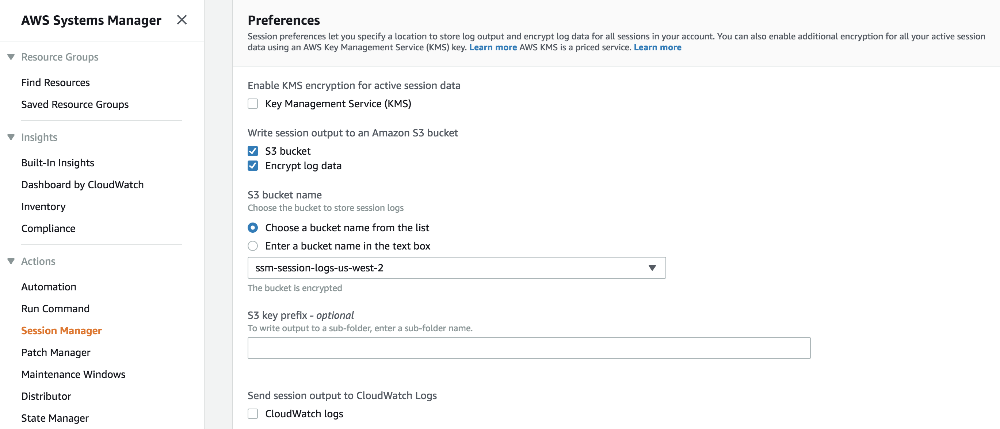

# SSM Session Manager demonstrated in three VPC/Subnet scenarios

Demonstrating the use of SSM Session Manager as alternative to enabling SSH access to 
EC2 instances

## Overview
Session Manager arrived as a tool in AWS Systems Manager (SSM) in Sept 2018.  It enables you to
open an interactive shell session to an EC2 host in the AWS Web Console.  This Jeff 
Barr [article](https://aws.amazon.com/blogs/aws/new-session-manager/) gives a nice introduction to the feature.

Here we have two CloudFormation templates that demonstrate three Session Manager connectivity scenarios

### `ssm-session-mgr-example.yaml`
- An EC2 in a public subnet with public ip and route to an Internet Gateway.
- An EC2 in a private subnet with route to a NAT Gateway.

### `ssm-session-mgr-privatelink-example.yaml`
- An EC2 in a private subnet of a VPC with no attached gateways.  Communication is enabled via PrivateLinks and 
  thus all traffic is kept on the Amazon network.
  

Both templates build everything within their own VPC, so simply run them in your account and follow the stack outputs 
for links to SSM Session Manager Console where you can initiate a terminal session with the EC2 instances.  Also the 
templates have thorough comments so look to those for further guidance.

As easy as that you will be logged into the EC2 instance as the admin user; `ssm-user`

note: You'll land in the `/bin/sh` shell. Simply execute `/bin/bash` if you are more familiar with that shell.
 

## Improved Security Posture

* No need to manage ssh keys for users
* In the Private Link scenario, all terminal session traffic is kept on the Amazon network and off the Internet
* Reduced attack surface area.  You can run with no publicly exposed ports and possibly even no bastion hosts in public subnets.
* Reduce permissions for `ssm-user`.  You can choose to reduce the permissions for the `ssm-user`, leaving the elevated `ec2-user` for Sysadmin use.
* Session activity logs are persisted in S3 and/or CloudWatch Logs

  You can alert on and audit these logs for suspicious behavior (part of a *defense in depth* strategy).
  In the SSM Session Manager [preferences](https://docs.aws.amazon.com/systems-manager/latest/userguide/session-manager-logging-auditing.html) 
  you can select to have session data including STDOUT recorded in an S3 bucket and/or CloudWatch Logs.  This gives 
  you a great mechanism for alerting on session activity or as an aid to forensics.
  

## Preconditions For SSM Session Management
There are a few preconditions required in order for SSM Session Manager to be able to connect to an EC2 instance.
**The provided CloudFormation templates accommodate these preconditions**, They are listed here for informational purposes.

### 1. SSM Agent is running in EC2 instance 
The SSM Agent in pre-installed on some of the core AWS AMIs including the latest Amazon Linux[1] and 2, but you can 
install it manually in other AMIs (and even on-prem). 
In our CloudFormation templates here we use Amazon Linux[1] and 2, so this box is checked for us, no action required.
If you are using older Amazon Linux[1] an AMIs that does not have the SSM agent pre-installed, see the 
[docs](https://docs.aws.amazon.com/systems-manager/latest/userguide/ssm-agent.html) for help with getting it installed.

### 2. EC2 Instance Profile Allowing SSM Management
By default, AWS Systems Manager does not have permission to perform actions on your EC2 instances.
There is an AWS-managed policy ([AmazonEC2RoleForSSM](https://docs.aws.amazon.com/systems-manager/latest/userguide/sysman-configuring-access-role.html)) 
that can be attached which gives SSM the required permissions to manage the instance.
This policy is a good starting point, examine it's permissions and determine if you want to go to production with it, if not 
you can provide your own scoped down policy.  Minimally you may want to limit S3 access to just what is needed by the instance and 
[SSM](https://docs.aws.amazon.com/systems-manager/latest/userguide/ssm-agent-minimum-s3-permissions.html).
